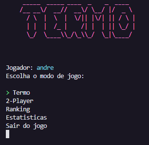
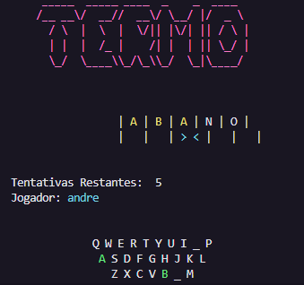
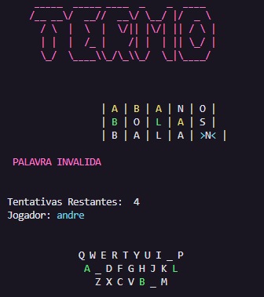
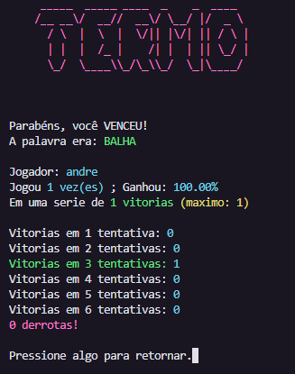

# TERMO_C

Copia do jogo Termo (Wordly em inglês) feito em C
Com um diferencial interessante: a possibilidade de jogar MULTIPLAYER (localmente)

### Imagens de tela







### Como rodar

> Necessário compilador CLANG

```
make
./main
```
